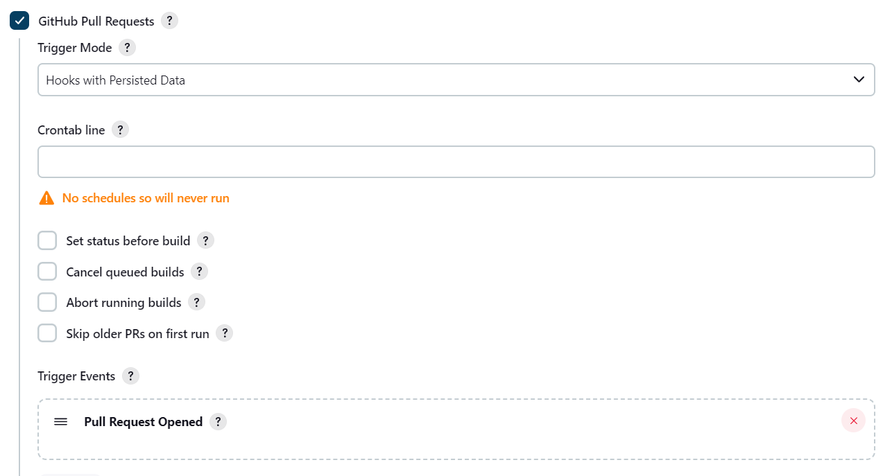
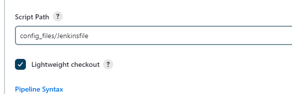
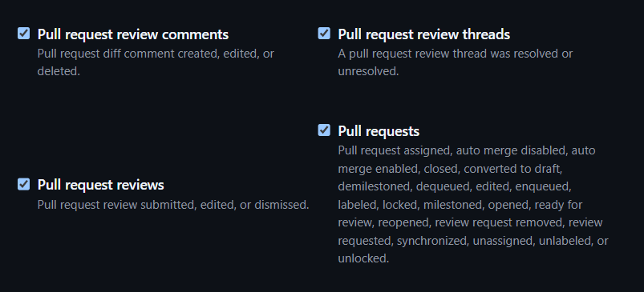

# SparkleBot - AI Driven PR Reviewer

## Step 1 - Jenkins Configuration

- Navigate to your pipeline project settings.
- Add the GitHub Project URL in General settings

- Enable GitHub Branches with Trigger Mode as “Cron with Persisted Data”

- Enable GitHub Pull Requests and set the `Trigger Mode` to `Hooks with Persisted Data` and the `Trigger Event` to `Pull Requests Opened`

- Scroll down towards the Pipeline Settings and set the `Definition` to `Pipeline Script from SCM`
    - Set the SCM as `Git`
    - Enter your Repository URL again
    - Specify the Branches to build (”main” in our case)
    - Finally, set the script path to `config_files/Jenkinsfile`

---

## Step 2 - Jenkins Credentials Configuration

Navigate to 

> Jenkins > Manage Jenkins > Credentials
> 

### a.) OpenAI API Key

Initialize your OpenAI API Key as a secret variable called `OPENAI_API_KEY`

### b.) GitHub Access Token

On GitHub, navigate to 

> Settings > Developer Settings > Personal Access Tokens > Tokens (Classic)
> 
- Click on `Generate New Token`
- Enable the following Scopes

---

## Step 3 - GitHub Configuration

Navigate to

> Project Repository > Settings > Webhooks
> 

- Add a webhook
- Add your payload URL where Jenkins is located
    - In my case, I am working locally and using ngrok to reroute my local IP
    
    
    
- Set Content Type to  `application/json`
- Enable SSL verification
- Set the following events
    - Pull Request Review Comments
    - Pull Request Review Threads
    - Pull Request Reviews
    - Pull Requests

- Add the following three files inside a folder titled `config_files`
    - Jenkinsfile
    - disclaimer.py
    - generate_report.py
    

---

## Step 4 - Jenkinsfile Configuration

As we are not currently executing these python scripts on Docker, we’re going to have to manually set up variables. 

### a.) `PYTHON_PATH` Environment Variable

Inside your Jenkinsfile, locate the environment variable titled `PYTHON_PATH` and set it to where python is installed on your computer (ensure the necessary libraries - openai and github - are installed)

### b.) `allowedAuthors` List

You can enable the pipeline to run on a specified list of authors or developers by providing their GitHub username. If an author outside of the list raises a PR, the pipeline will not trigger.

### c.) `.py` Files [IMPORTANT]

Out of the box, the Bot will work for python files as specified by `line 55` 

`git diff origin/main...origin/$env:GITHUB_PR_SOURCE_BRANCH -- *.py > git_diff.txt`

If you would like for it to work for any other extension such as .js or .cpp feel free to edit this here.

If you would like for it to work on every type of file in your repository, use the following command:

`git diff origin/main...origin/$env:GITHUB_PR_SOURCE_BRANCH > git_diff.txt`

---

## Step 5 - Testing

If configured correctly, create a file in a test branch or modify an existing file from main inside test branch then proceed to open a Pull Request after successful commit.

The pipeline should be triggered and all stages should be successfully executed.

This will result in a comprehensive Code Review to be posted covering 9 different headings and code samples

- Overview of Changes
- Code Quality and Best Practices
- Performance Considerations
- Testing and Validation
- Security Implications
- Documentation and Comments
- Impact Analysis
- Potential Risks and Red Flags
- Future Considerations

